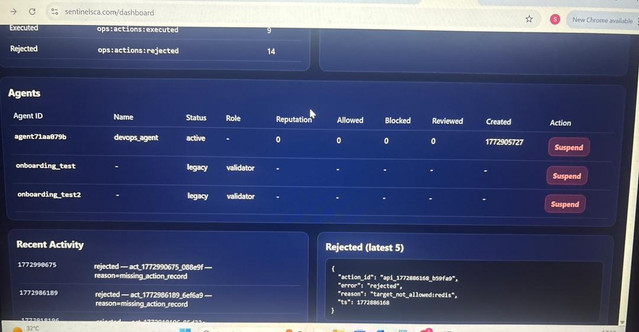

# Sentinel SCA

Governance infrastructure for autonomous AI systems.

Sentinel SCA is governance infrastructure for AI agents that enforces security policies, records actions in a tamper-evident ledger, and enables forensic replay of autonomous systems.

Sentinel sits between autonomous agents and real infrastructure, verifying identity, evaluating policy decisions, and governing how AI actions are executed.

---

# Why Sentinel Exists

AI agents are increasingly able to perform real infrastructure actions:

- restarting services
- deploying code
- modifying databases
- executing cloud operations

Without a control boundary, these actions can become unsafe.

Sentinel SCA introduces a governance layer between AI systems and infrastructure, ensuring every action is authenticated, evaluated, and recorded.

---

# Sentinel SCA 13-Layer Governance Architecture

Every AI action passes through a deterministic governance pipeline.

AI Agent  
↓  
Agent Identity (Ed25519)  
↓  
Capability Tokens  
↓  
Schema Validation  
↓  
Behavior Limits  
↓  
Policy Engine  
↓  
Deterministic Action Hash  
↓  
Execution Worker  
↓  
AI Action Report  
↓  
Execution Ledger  
↓  
Hash-Chained Audit Log  
↓  
Live Action Timeline  
↓  
Action Replay & Forensics  

---

# Core Capabilities

## Agent Identity
Agents authenticate using Ed25519 cryptographic signatures, ensuring every action is attributable to a specific autonomous system.

## Deterministic Policy Engine
Every request is evaluated against explicit policy rules:

ALLOW  
REVIEW  
DENY  

High-risk actions are automatically routed for human approval.

## Controlled Execution
Approved actions are executed only through Sentinel execution workers.

## Tamper-Evident Ledger
All actions are recorded in a hash-chained ledger preventing silent modification.

## Live Timeline
Operators can observe real-time agent activity and decisions.

## Replay & Forensics
Any historical event can be reconstructed to understand what happened and why.

## Agent Security Scoring
Sentinel continuously evaluates agent behavior and assigns security scores based on governance outcomes and risk patterns.

---

# Example AI Action Report

AI ACTION REPORT
----------------

Agent: deploy-bot-7  
Identity: ed25519:f83a...  

Capability: restart_service  

Target: redis  

Decision: REVIEW  
Policy Version: v2  

Timestamp: 2026-03-15T16:45Z  

Action Hash: 42655ff1...  
Previous Hash: 482248ea...  

---

# Use Cases

AI DevOps Agents  
Autonomous Infrastructure Systems  
Multi-Agent Environments  
Security & Compliance Monitoring  

---

# Quick Start

git clone https://github.com/sentinelSCA/sentinel.git  
cd sentinel  

Documentation is available in:

docs/

---

# Documentation

docs/protocol.md  
docs/architecture.md  
docs/operator-runbook.md  

---

# Security

Report vulnerabilities privately:

contact@sentinelsca.com

See SECURITY.md for responsible disclosure.

---

# License

MIT License
